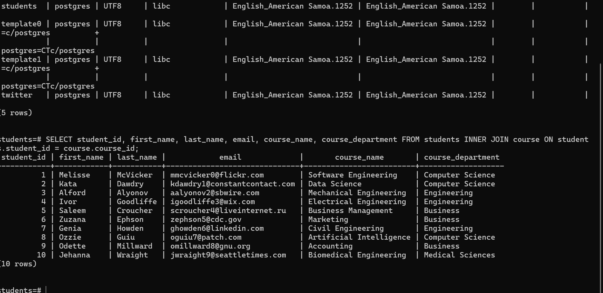
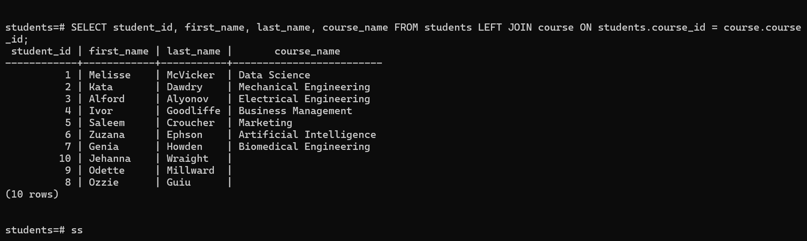
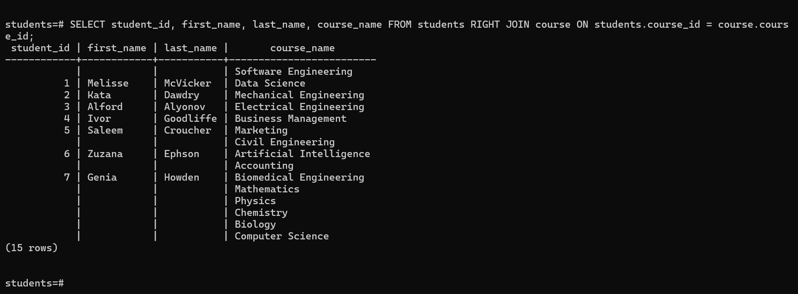
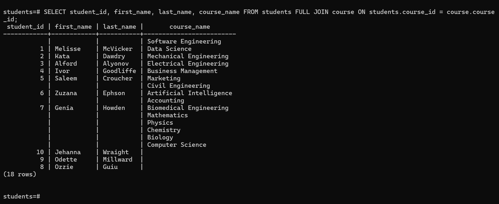
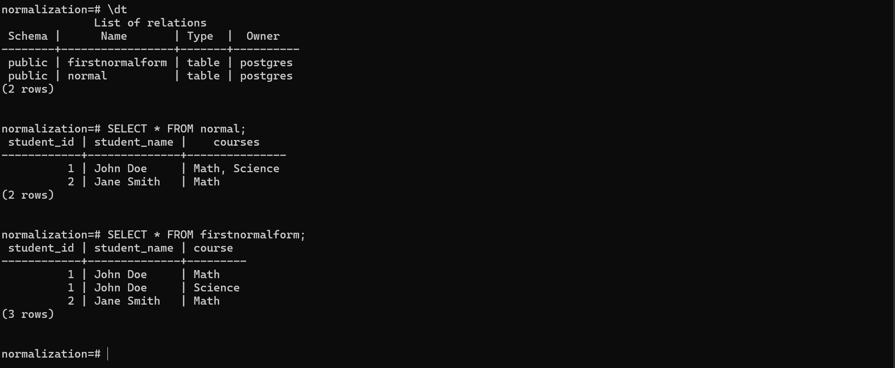
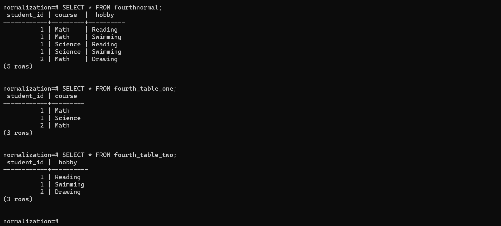

<h1>Database concepts</h1>

<h2>Joins</h2>

A JOIN clause is used to combine rows from two or more tables, based on a related column between them.
1. **INNER JOIN**  
   Returns records that have matching values in both tables.   
   
3. **LEFT JOIN**  
   Returns all records from the left table and the matched records from the right table.  
    
5. **RIGHT JOIN** 
   Returns all records from the right table and the matched records from the left table.  
    
7. **FULL JOIN**  
   Returns all records when there is a match in either left or right table.  
    

   --
<h2>ACID Properties</h2>
ACID stands for Atomicity, Consistency, Isolation, and Durability. These properties ensure reliable database transactions.

- **A = Atomicity**
  Database transactions must be all or nothing. If any part of the transaction fails, the entire transaction is rolled back.  
  **Example:**  
  When transferring money between two accounts, either both the debit and credit occur, or neither occurs, ensuring no partial transaction.

- **C = Consistency**  
  Only valid data is written to the database, ensuring accuracy and correctness.  
  **Example:**  
  A transaction that exceeds the permissible overdraft limit of a bank account will be blocked to maintain data consistency.

- **I = Isolation**  
  Transactions are processed independently of one another, preventing one transaction from interfering with another until it is committed.  
  **Example:**  
  If one transaction is updating a row, other transactions will not see the update until the first transaction is committed.

- **D = Durability**  
  Once a transaction is committed, it will remain in the system even in case of a failure.  
  **Example:**  
  If a transaction updates customer data, the changes will persist even after a system crash.

---
<h2>Normalization</h2>
Normalization is the process of organizing data in a database to eliminate redundancy and improve data integrity.

<h3>Types of Normalization:</h3>

1. **First Normal Form (1NF)**  
A relation is in 1NF if it contains only atomic (indivisible) values.  

2. **Second Normal Form (2NF))**  
 A relation is in 2NF if it is in 1NF and all non-key attributes are fully dependent on the primary key.  

3. **Third Normal Form (3NF)**  
A relation is in 3NF if it is in 2NF and there is no transitive dependency.  

4. **Boyce-Codd Normal Form (BCNF)**  
A stronger version of 3NF, ensuring that every determinant is a candidate key.  

5. **Fourth Normal Form (4NF)**  
A relation is in 4NF if it is in BCNF and has no multi-valued dependencies.  

